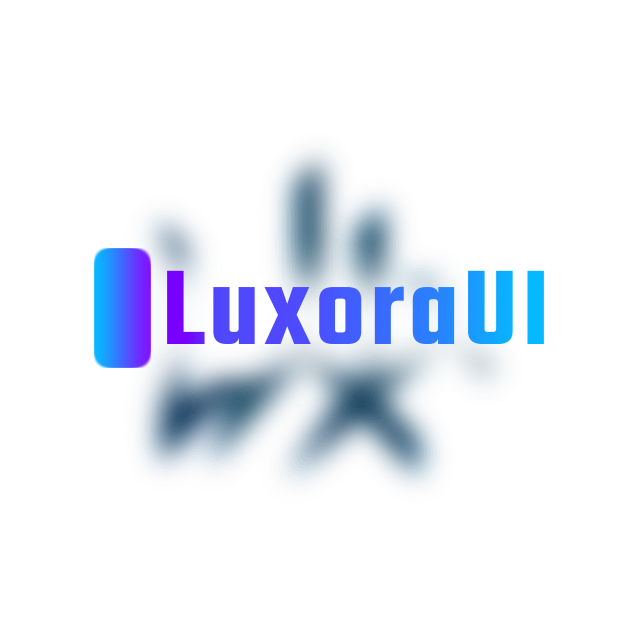

<p align="center">
  
</p>

<h1 align="center">LuxoraUI</h1>
<p align="center">
  <em>Elegant, lightweight & modern CSS + Icon library</em>
</p>

<p align="center">
  
  
  
</p>

---

## ✨ Features

- 🎨 **Custom Icon Font** → Lightweight, scalable vector icons.  
- ⚡ **Built-in Animations** → Bounce, Fade, Zoom & more.  
- 🧩 **Easy Integration** → Use via CDN or local files.  
- 🚀 **No Dependencies** → Pure CSS (optional JS for animation triggers).  
- 🖤 **Brand Feel** → Modern design + luxury naming.

---

## 🚀 Getting Started

### 1. Via CDN
```html
<link rel="stylesheet" href="https://cdn.jsdelivr.net/gh/Yashh-Penchi/LuxoraUI@main/LuxoraUICSS/LuxoraUI.min.css">

